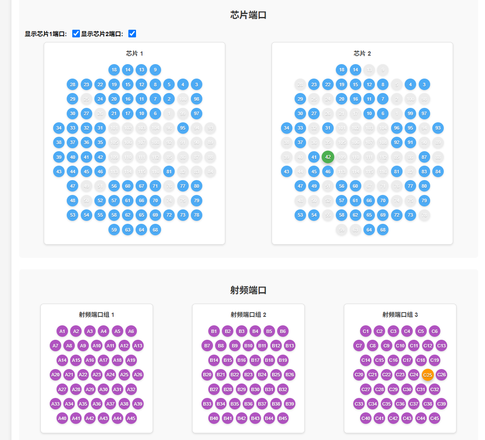

# 芯片与射频端口连接管理系统

## 项目概述

这是一个基于Web的交互式界面，用于可视化管理和配置芯片端口与射频端口之间的连接关系。系统提供直观的图形化界面，支持自定义端口布局和灵活的连接关系配置。


## 功能特性

- **可视化端口管理**：以圆形矩阵形式展示芯片和射频端口
- **自定义布局**：可配置行数、每行端口数和端口索引
- **连接关系配置**：定义芯片端口与射频端口的对应关系
- **状态同步**：点击端口时自动同步对应连接端口的状态
- **错误检查**：自动检测重复连接和无效配置

## 使用说明

### 1. 基本配置

在"配置"区域设置每个组件的布局：

1. **行数和每行端口数**：
   - 格式：`行数,每行端口数 每行端口数...`
   - 示例：`3,5 4 5` 表示3行，分别有5、4、5个端口

2. **自定义端口索引**（可选）：
   - 格式：JSON二维数组
   - 示例：
     ```json
     [
       ["A1","A2","A3","A4","A5"],
       ["B1","B2","B3","B4"],
       ["C1","C2","C3","C4","C5"]
     ]
     ```

### 2. 连接关系配置

在"连接关系配置"区域定义端口对应关系：

- **格式**：`芯片编号:端口索引=射频组编号:端口索引`
- **示例**：
  ```
  1:31=2:11
  1:12=3:5
  2:3_2=1:1_4
  ```
- **说明**：
  - 芯片编号：1或2
  - 射频组编号：1、2或3
  - 端口索引：可以是数字、字符串或行列组合（如"3_2"）

### 3. 操作按钮

- **初始化所有组件**：根据当前配置重新初始化所有端口
- **应用连接关系**：应用当前定义的连接关系配置

## 界面说明

1. **芯片端口区域**：
   - 显示两个芯片的端口布局
   - 默认颜色：蓝色（未选中）、绿色（选中）、灰色（禁用）

2. **射频端口区域**：
   - 显示三个射频组的端口布局
   - 默认颜色：紫色（未选中）、橙色（选中）、灰色（禁用）

3. **状态显示区域**：
   - 显示操作结果或错误信息

## 开发与扩展

### 项目结构

- **HTML**：界面布局和结构
- **CSS**：界面样式和视觉效果
- **JavaScript**：
  - `CircleMatrix.js`：圆形矩阵组件核心逻辑
  - 主脚本：界面交互和业务逻辑

### 自定义样式

可以通过修改CSS中的颜色变量来自定义外观：

```css
.chip-circle {
  background-color: #2196F3; /* 芯片端口默认颜色 */
}
.chip-circle.selected {
  background-color: #4CAF50; /* 芯片端口选中颜色 */
}
.rf-circle {
  background-color: #9C27B0; /* 射频端口默认颜色 */
}
.rf-circle.selected {
  background-color: #FF9800; /* 射频端口选中颜色 */
}
```

### 扩展建议

1. **导入/导出配置**：添加JSON配置文件的导入导出功能
2. **端口分组**：支持更多层次的端口分组和嵌套
3. **连接线可视化**：在端口之间绘制连接线
4. **批量操作**：支持批量选择/取消选择端口

## 注意事项

1. 连接关系配置中的端口索引必须与组件初始化时使用的索引一致
2. JSON格式的索引配置必须使用有效的JSON语法
3. 端口连接关系不能重复（一个端口只能连接一个对应端口）

## 示例配置

```text
芯片1配置: 3,5 4 5
芯片1索引: [["A1","A2","A3","A4","A5"],["B1","B2","B3","B4"],["C1","C2","C3","C4","C5"]]

连接关系:
1:A1=1:R1
1:A2=1:R2
1:B1=1:S1
2:D1=2:T1
2:D2=3:U1
```

## 许可证

本项目采用MIT许可证开源，可自由使用和修改。